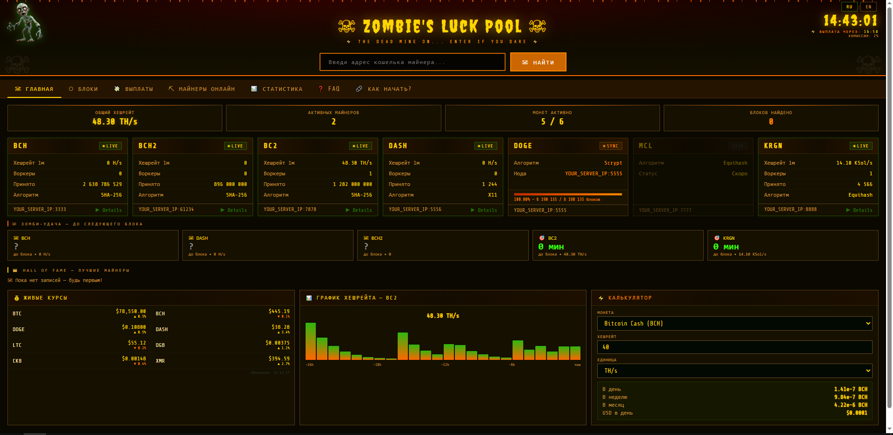
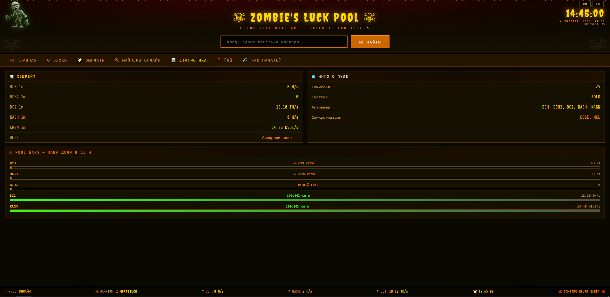
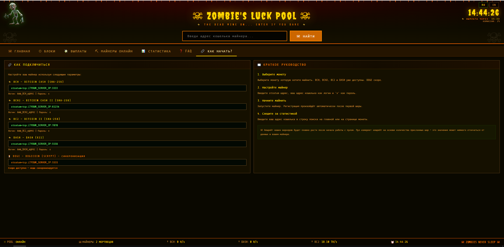
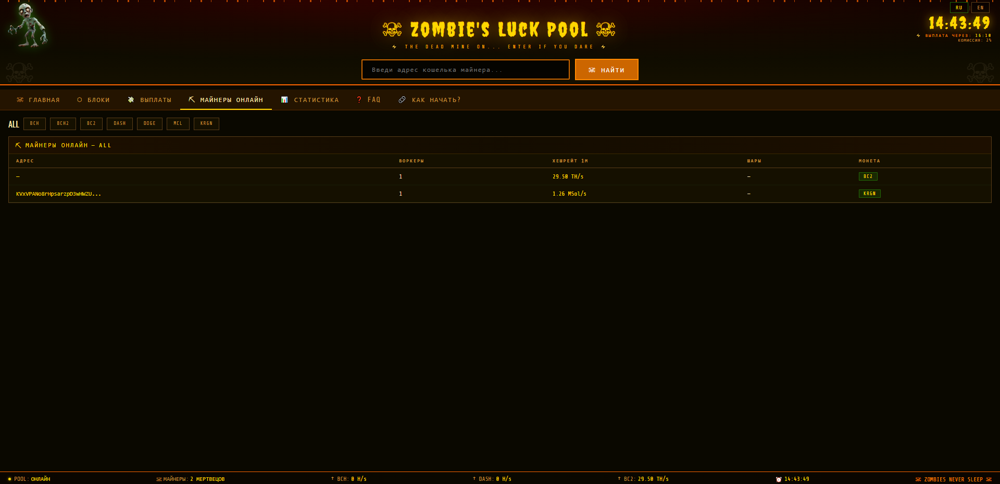
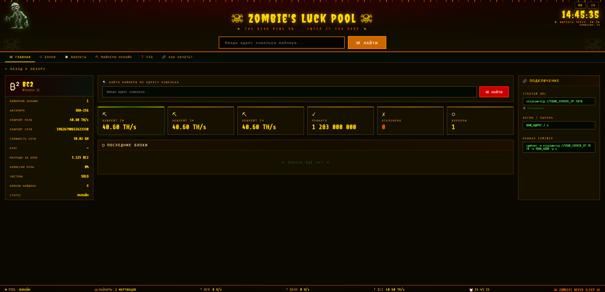

# 🧟 Zombie's Luck Pool

> **Ready-to-use Solo Mining Pool with unique zombie-style design**


## ✨ Features

- 🎨 Unique dark zombie-style web interface (RU/EN)
- ⛏️ Multi-algorithm: SHA-256, X11, Equihash, Scrypt
- 🪙 Multi-coin: BCH, BCH2, BC2, DASH, DOGE, KRGN, MCL
- 🤖 Telegram bot with real-time notifications
- 👥 Miners online dashboard
- 💀 Zombie Luck counter (time to next block)
- 👑 Hall of Fame
- ⚔️ Pool Wars — network share tracker
- 📊 Live prices & mining calculator
- 🐳 Docker ready — deploy in 5 minutes
- 🔒 User agreement popup
- 🔐 UFW firewall configured

## 🚀 Quick Start

```bash
git clone https://github.com/zoombak/zombies-luck-pool
cd zombies-luck-pool
cp .env.example .env
# Edit .env with your settings
docker-compose up -d
```

## 📸 Screenshots

*Web interface, Telegram bot, Miners dashboard*

## 💰 Commercial License

This is a **commercial project**.  
Full source code available for purchase — **exclusive license**.

📧 Contact: zombak47@proton.me

## 🔧 Tech Stack

- Node.js + Express
- Docker + Docker Compose  
- s-nomp stratum server
- ckpool
- Telegram Bot API





